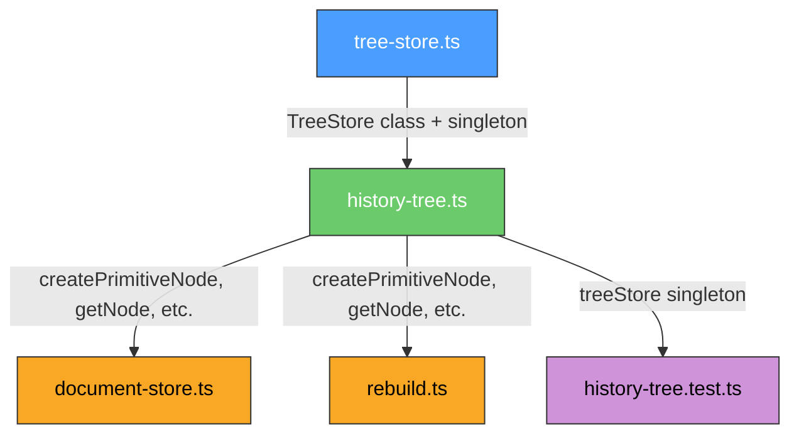

# План: Инкапсуляция глобального состояния `treeNodes` (CRIT-1)

## 1. Анализ текущего состояния

### Текущая архитектура

В файле `web-app/src/csg/history-tree.ts`:

```typescript
const treeNodes = new Map<string, TreeNode>()  // строка 33 — НЕ экспортируется
```

Уже есть функции-обёртки:
- `getNode(id)` — `treeNodes.get(id)`
- `setNode(id, node)` — `treeNodes.set(id, node)`
- `deleteNode(id, recursive?)` — удаление с опциональным рекурсивным удалением детей
- `clearTree()` — `treeNodes.clear()`
- `getAllNodes()` — `[...treeNodes.values()]`

Эти функции используются **внутри** `history-tree.ts` (в `createPrimitiveNode`, `createBooleanNode`, `createBakedNode`, `computeNodeBBox`, `computeNodeHash`, `isAncestor`, `invalidateCache`, `rebuildNode`, `collectSubtreeForWorker`, `applyCSGMeshes`, `mirrorTreeNode`, `mirrorNodeRecursive`, `moveTreeNode`, `applyTransformToPrimitives`, `rotateTreeNode`, `syncNodeTransform`, `applyNodeTransform`, `cloneSubtree`, `cloneRecursive`, `printTree`) — всего **28 обращений** к `treeNodes`.

### Файлы, импортирующие из history-tree.ts

| Файл | Импортируемые функции |
|---|---|
| `document-store.ts` | `createPrimitiveNode`, `createBooleanNode`, `createBakedNode`, `mirrorTreeNode`, `syncNodeTransform`, `cloneSubtree`, `rebuildNode`, `computeNodeBBox`, `bboxCenter`, `getNode`, `deleteNode`, `clearTree`, `getAllNodes` |
| `rebuild.ts` | `createPrimitiveNode`, `createBooleanNode`, `createBakedNode`, `getNode` |
| `history-tree.test.ts` | `createPrimitiveNode`, `createBooleanNode`, `createBakedNode`, `deleteNode`, `getNode`, `clearTree`, `computeNodeBBox`, `bboxCenter`, `isAncestor`, `mirrorTreeNode`, `moveTreeNode`, `rotateTreeNode`, `cloneSubtree`, `rebuildNode`, `printTree` |

**Важно:** `treeNodes` НЕ импортируется напрямую нигде — только через функции-обёртки. Это упрощает миграцию.

### Проблемы

1. **Глобальное мутируемое состояние** — `Map` живёт на уровне модуля
2. **Нет инкапсуляции** — любая функция может вызвать `treeNodes.set/get/delete`
3. **Проблемы с тестированием** — состояние сохраняется между тестами (решается `clearTree()` в `beforeEach`)
4. **Несовместимость с SSR/Concurrent mode**
5. **Дублирование кода** — функции-обёртки дублируют методы `Map`

---

## 2. Проектирование класса `TreeStore`

### Новый файл: `web-app/src/csg/tree-store.ts`

```typescript
// ============================================================
// TreeStore — инкапсулированное хранилище узлов дерева сборки
// ============================================================

import type { TreeNode } from './types'

export class TreeStore {
  private _nodes = new Map<string, TreeNode>()

  /** Получить узел по ID */
  getNode(id: string): TreeNode | undefined {
    return this._nodes.get(id)
  }

  /** Установить узел */
  setNode(id: string, node: TreeNode): void {
    this._nodes.set(id, node)
  }

  /**
   * Удалить узел.
   * @param recursive — если true, рекурсивно удаляет всех детей
   */
  deleteNode(id: string, recursive = false): void {
    const node = this._nodes.get(id)
    if (node) {
      if (recursive && node.children) {
        for (const childId of node.children) {
          this.deleteNode(childId, true)
        }
      } else if (node.children) {
        for (const childId of node.children) {
          const child = this._nodes.get(childId)
          if (child) child.parentId = undefined
        }
      }
      if (node.parentId) node.parentId = undefined
    }
    this._nodes.delete(id)
  }

  /** Очистить всё дерево */
  clear(): void {
    this._nodes.clear()
  }

  /** Получить все узлы как массив */
  getAllNodes(): TreeNode[] {
    return [...this._nodes.values()]
  }

  /** Получить все узлы как ReadonlyMap */
  getAllNodesMap(): ReadonlyMap<string, TreeNode> {
    return this._nodes
  }

  /** Количество узлов */
  get nodeCount(): number {
    return this._nodes.size
  }

  /** Проверить существование узла */
  hasNode(id: string): boolean {
    return this._nodes.has(id)
  }
}

/** Singleton для обратной совместимости */
export const treeStore = new TreeStore()
```

### Ключевые решения

1. **`getAllNodesMap()`** — возвращает `ReadonlyMap<string, TreeNode>` для случаев, когда нужен обход без копирования (сейчас используется в `applyCSGMeshes` строка 489: `const nodes: typeof treeNodes = new Map()`)
2. **`hasNode()`** — для проверки существования без получения значения
3. **`nodeCount`** — геттер вместо отдельного метода
4. **Singleton** — экспортируется для обратной совместимости, но может быть заменён на инстанс из DI в будущем

---

## 3. Изменения в `history-tree.ts`

### Что меняется

1. **Удалить** строки 28-70 (секция Storage) — `treeNodes`, `getNode`, `setNode`, `deleteNode`, `clearTree`, `getAllNodes`
2. **Добавить** импорт `treeStore` из `./tree-store`
3. **Заменить** все `treeNodes.get(id)` → `treeStore.getNode(id)`
4. **Заменить** все `treeNodes.set(id, node)` → `treeStore.setNode(id, node)`
5. **Заменить** все `treeNodes.delete(id)` → `treeStore.deleteNode(id, ...)` (уже есть внутри `deleteNode`)
6. **Заменить** `treeNodes.clear()` → `treeStore.clear()`
7. **Заменить** `[...treeNodes.values()]` → `treeStore.getAllNodes()`
8. **Заменить** `typeof treeNodes` (строка 489) → `Map<string, TreeNode>` (тип напрямую)
9. **Экспортировать `treeStore`** для доступа из тестов

### Полный список замен (28 обращений)

| Строка | Было | Стало |
|---|---|---|
| 36 | `treeNodes.get(id)` | `treeStore.getNode(id)` |
| 40 | `treeNodes.set(id, node)` | `treeStore.setNode(id, node)` |
| 44 | `treeNodes.get(id)` | `treeStore.getNode(id)` |
| 54 | `treeNodes.get(childId)` | `treeStore.getNode(childId)` |
| 61 | `treeNodes.delete(id)` | `treeStore.deleteNode(id)` (уже рекурсивно) |
| 65 | `treeNodes.clear()` | `treeStore.clear()` |
| 69 | `[...treeNodes.values()]` | `treeStore.getAllNodes()` |
| 90 | `treeNodes.set(id, node)` | `treeStore.setNode(id, node)` |
| 125 | `treeNodes.set(id, node)` | `treeStore.setNode(id, node)` |
| 128 | `treeNodes.get(childA)` | `treeStore.getNode(childA)` |
| 129 | `treeNodes.get(childB)` | `treeStore.getNode(childB)` |
| 152 | `treeNodes.set(id, node)` | `treeStore.setNode(id, node)` |
| 162 | `treeNodes.get(nodeId)` | `treeStore.getNode(nodeId)` |
| 312 | `treeNodes.get(id)` | `treeStore.getNode(id)` |
| 326 | `treeNodes.get(nodeId)` | `treeStore.getNode(nodeId)` |
| 329 | `treeNodes.get(current.parentId)` | `treeStore.getNode(current.parentId)` |
| 351 | `treeNodes.get(nodeId)` | `treeStore.getNode(nodeId)` |
| 372 | `treeNodes.get(nodeId)` | `treeStore.getNode(nodeId)` |
| 441 | `treeNodes.get(id)` | `treeStore.getNode(id)` |
| 489 | `typeof treeNodes` | `Map<string, TreeNode>` |
| 491 | `treeNodes.get(id)` | `treeStore.getNode(id)` |
| 638 | `treeNodes.get(nodeId)` | `treeStore.getNode(nodeId)` |
| 705 | `treeNodes.get(childId)` | `treeStore.getNode(childId)` |
| 717 | `treeNodes.get(nodeId)` | `treeStore.getNode(nodeId)` |
| 742 | `treeNodes.get(childId)` | `treeStore.getNode(childId)` |
| 757 | `treeNodes.get(nodeId)` | `treeStore.getNode(nodeId)` |
| 820 | `treeNodes.get(id)` | `treeStore.getNode(id)` |
| 843 | `treeNodes.get(nodeId)` | `treeStore.getNode(nodeId)` |
| 863 | `treeNodes.get(sourceId)` | `treeStore.getNode(sourceId)` |
| 876 | `treeNodes.get(sourceId)` | `treeStore.getNode(sourceId)` |
| 917 | `treeNodes.set(newId, clone)` | `treeStore.setNode(newId, clone)` |
| 932 | `treeNodes.get(nodeId)` | `treeStore.getNode(nodeId)` |

### Экспорты, которые остаются

Все публичные функции **остаются** с теми же сигнатурами:
- `createPrimitiveNode`, `createBooleanNode`, `createBakedNode`
- `computeNodeBBox`, `bboxCenter`
- `isAncestor`
- `mirrorTreeNode`, `moveTreeNode`, `rotateTreeNode`
- `syncNodeTransform`, `applyNodeTransform`
- `cloneSubtree`
- `rebuildNode`
- `printTree`

**Добавить** экспорт:
- `treeStore` — для тестов и будущего использования

---

## 4. Изменения в `history-tree.test.ts`

### Добавить тесты для `TreeStore`

```typescript
import { treeStore } from '../csg/history-tree'

describe('TreeStore', () => {
  beforeEach(() => {
    treeStore.clear()
  })

  it('should set and get a node', () => {
    const node: TreeNode = { id: 'test', type: 'primitive', shapeType: 'cube', params: {}, localTransform: defaultTransform }
    treeStore.setNode('test', node)
    expect(treeStore.getNode('test')).toBe(node)
  })

  it('should return undefined for non-existent node', () => {
    expect(treeStore.getNode('nonexistent')).toBeUndefined()
  })

  it('should delete a node', () => {
    treeStore.setNode('test', { id: 'test', type: 'primitive', shapeType: 'cube', params: {}, localTransform: defaultTransform })
    treeStore.deleteNode('test')
    expect(treeStore.getNode('test')).toBeUndefined()
  })

  it('should clear all nodes', () => {
    treeStore.setNode('a', { id: 'a', type: 'primitive', shapeType: 'cube', params: {}, localTransform: defaultTransform })
    treeStore.setNode('b', { id: 'b', type: 'primitive', shapeType: 'cube', params: {}, localTransform: defaultTransform })
    treeStore.clear()
    expect(treeStore.nodeCount).toBe(0)
  })

  it('should return all nodes', () => {
    treeStore.setNode('a', { id: 'a', type: 'primitive', shapeType: 'cube', params: {}, localTransform: defaultTransform })
    treeStore.setNode('b', { id: 'b', type: 'primitive', shapeType: 'cube', params: {}, localTransform: defaultTransform })
    expect(treeStore.getAllNodes()).toHaveLength(2)
  })

  it('should return node count', () => {
    expect(treeStore.nodeCount).toBe(0)
    treeStore.setNode('a', { id: 'a', type: 'primitive', shapeType: 'cube', params: {}, localTransform: defaultTransform })
    expect(treeStore.nodeCount).toBe(1)
  })

  it('should check node existence', () => {
    treeStore.setNode('a', { id: 'a', type: 'primitive', shapeType: 'cube', params: {}, localTransform: defaultTransform })
    expect(treeStore.hasNode('a')).toBe(true)
    expect(treeStore.hasNode('b')).toBe(false)
  })

  it('should delete recursively', () => {
    treeStore.setNode('a', { id: 'a', type: 'primitive', shapeType: 'cube', params: {}, localTransform: defaultTransform })
    treeStore.setNode('b', { id: 'b', type: 'primitive', shapeType: 'cube', params: {}, localTransform: defaultTransform })
    treeStore.setNode('parent', { id: 'parent', type: 'boolean', operation: 'union', children: ['a', 'b'] })
    treeStore.deleteNode('parent', true)
    expect(treeStore.hasNode('parent')).toBe(false)
    expect(treeStore.hasNode('a')).toBe(false)
    expect(treeStore.hasNode('b')).toBe(false)
  })

  it('should return ReadonlyMap from getAllNodesMap', () => {
    treeStore.setNode('a', { id: 'a', type: 'primitive', shapeType: 'cube', params: {}, localTransform: defaultTransform })
    const map = treeStore.getAllNodesMap()
    expect(map.get('a')).toBeDefined()
    expect(map.size).toBe(1)
  })
})
```

### Существующие тесты

Изменить `beforeEach` с `clearTree()` на `treeStore.clear()` (если `clearTree` будет удалена из экспорта). Либо оставить `clearTree()` как есть — она будет внутри вызывать `treeStore.clear()`.

---

## 5. Изменения в других файлах

### `document-store.ts`

**Никаких изменений в импортах не требуется.** Все функции, которые импортируются из `history-tree.ts`, остаются с теми же сигнатурами.

### `rebuild.ts`

**Никаких изменений в импортах не требуется.** Все функции, которые импортируются из `history-tree.ts`, остаются с теми же сигнатурами.

### `worker-handlers.ts`

**Никаких изменений.** `worker-handlers.ts` не импортирует `treeNodes` или функции из `history-tree.ts`.

---

## 6. Порядок миграции

### Шаг 1: Создать `web-app/src/csg/tree-store.ts`

Создать новый файл с классом `TreeStore` и singleton `treeStore`.

### Шаг 2: Обновить `history-tree.ts`

1. Добавить импорт `treeStore` из `./tree-store`
2. Удалить секцию Storage (строки 28-70)
3. Заменить все обращения к `treeNodes` на вызовы `treeStore.*`
4. Заменить `typeof treeNodes` на `Map<string, TreeNode>`
5. Добавить экспорт `treeStore`
6. Оставить все публичные функции без изменений сигнатур

### Шаг 3: Обновить `history-tree.test.ts`

1. Добавить тесты для `TreeStore`
2. Убедиться, что существующие тесты проходят (они используют `clearTree()` в `beforeEach`)

### Шаг 4: Проверить сборку

```bash
cd web-app && pnpm typecheck && pnpm test
```

---

## 7. Диаграмма зависимостей после изменений



---

## 8. Резюме изменений

| Файл | Тип изменений |
|---|---|
| `web-app/src/csg/tree-store.ts` | **НОВЫЙ** — класс TreeStore + singleton |
| `web-app/src/csg/history-tree.ts` | **ИЗМЕНЕНИЕ** — удалить `treeNodes`, использовать `treeStore`, добавить экспорт `treeStore` |
| `web-app/src/csg/history-tree.test.ts` | **ИЗМЕНЕНИЕ** — добавить тесты для TreeStore |
| `web-app/src/store/document-store.ts` | **БЕЗ ИЗМЕНЕНИЙ** |
| `web-app/src/store/rebuild.ts` | **БЕЗ ИЗМЕНЕНИЙ** |
| `web-app/src/csg/worker-handlers.ts` | **БЕЗ ИЗМЕНЕНИЙ** |

### Ключевые преимущества

1. ✅ **Инкапсуляция** — `Map` приватный, доступ только через методы класса
2. ✅ **Контролируемый API** — чёткий набор методов вместо прямых операций с Map
3. ✅ **Тестируемость** — можно создать отдельный инстанс для тестов
4. ✅ **Обратная совместимость** — все публичные функции сохраняют сигнатуры
5. ✅ **ReadonlyMap** — `getAllNodesMap()` предотвращает мутацию извне
6. ✅ **SSR-ready** — singleton может быть заменён на инстанс из контекста
