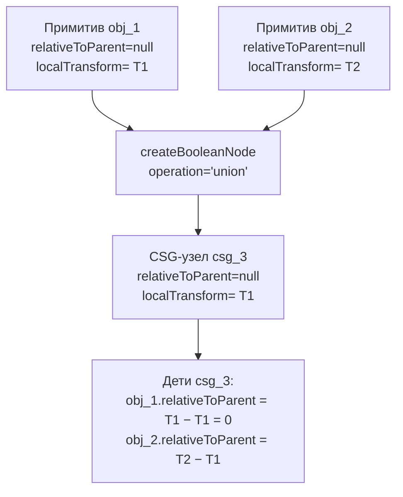
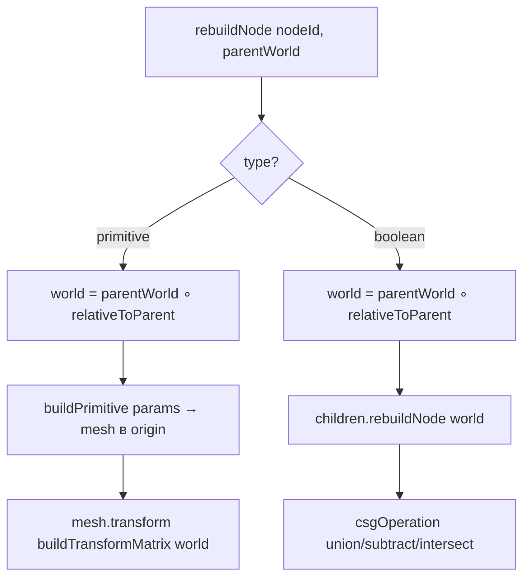
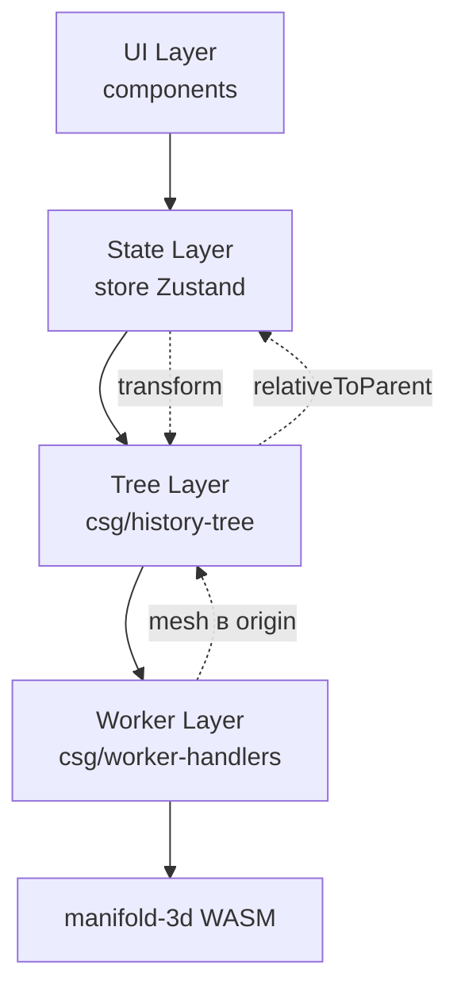

# 🏗️ ARCHITECTURE_TRANSFORMS.md

**Единая модель трансформов для TinkerCraft Web (Фаза 8)**

Версия: 1.0 · Дата: 2026-10-08 · Статус: утверждено

---

## 1. ПРИНЦИПЫ

| № | Принцип | Следствие |
|---|---------|-----------|
| 1 | **`relativeToParent` — единственный источник истины** | `localTransform` — вычисляемый, только для UI |
| 2 | **`vertices` всегда в origin (центрированы по центру масс)** | Transform применяется **один раз** при рендере/CSG |
| 3 | **Transform применяется ровно один раз** | Никаких «двойных применений» |
| 4 | **`rebuildNode` комбинирует `parentWorld ∘ relativeToParent`** | Рекурсивный обход дерева сверху вниз |
| 5 | **Все примитивы центрированы по центру масс, не по BBox** | Правильное поведение при повороте |

---

## 2. МОДЕЛЬ ДАННЫХ

### 2.1. `TreeNode` (Build Tree)

```typescript
interface TreeNode {
  id: string
  type: 'primitive' | 'boolean' | 'baked'
  shapeType?: ShapeType
  params?: ShapeParams
  operation?: 'union' | 'subtract' | 'intersect'
  children?: string[]
  parentId?: string

  // ✅ ИСТОЧНИК ИСТИНЫ
  relativeToParent: {
    positionDelta: Vec3
    rotationDelta: Vec3
    scaleRatio: Vec3
  } | null   // null для корневых нод

  // ⚠️ ВЫЧИСЛЯЕМЫЙ (только для UI)
  localTransform?: TransformNR

  // Для baked-нод (импорт STL, CSG-результаты)
  vertices?: Float32Array
  indices?: Uint32Array
  normals?: Float32Array | null

  // Кэш
  cachedMesh?: ExtractedMesh
  cachedBBox?: BoundingBox
  cacheHash?: string
}
```

**Правило:** любое изменение трансформа узла = изменение `relativeToParent`.

### 2.2. `SceneObject` (Viewport)

```typescript
interface SceneObject {
  id: string
  shapeType: ShapeType | 'csg'
  params: ShapeParams | null

  // ✅ ВСЕГДА в origin (центрированы по центру масс)
  vertices: Float32Array
  indices: Uint32Array
  normals?: Float32Array | null

  // ✅ Мировой pivot (применяется в Viewport3D)
  transform: TransformNR

  // ... (color, visible, name и т.д.)
}
```

**Правило:** `vertices` **никогда** не содержат позицию/rotation/scale. Всё — в `transform`.

---

## 3. ПОТОК ДАННЫХ

### 3.1. Создание CSG



### 3.2. Rebuild



**Ключевое:** transform применяется к **origin-мешу** ровно **один раз**.

---

## 4. ОПЕРАЦИИ

| Операция | Что меняется | `relativeToParent` | `vertices` |
|----------|--------------|-------------------|------------|
| **move** | позиция | + delta | не трогаем |
| **rotate** | вращение | + delta | не трогаем |
| **scale** | масштаб | × ratio | не трогаем |
| **resize** | params | не меняется | не трогаем |
| **mirror** | зеркало | mirror relativeToParent | не трогаем |
| **CSG** | новый узел | — | пересчитываются |
| **clone** | копия | deep copy | deep copy |
| **delete** | удаление | — | — |

**Правило:** операции меняют **`relativeToParent`**, а **не** `vertices`.

---

## 5. ЦЕНТРИРОВАНИЕ

### 5.1. Примитивы

**Все примитивы центрированы по ЦЕНТРУ МАСС в origin.**

| Примитив | Как центрируется | Центр масс |
|----------|------------------|------------|
| cube | `Manifold.cube(..., true)` | `(0,0,0)` |
| sphere | `Manifold.sphere(r, seg)` | `(0,0,0)` |
| cylinder | `Manifold.cylinder(..., true)` | `(0,0,0)` |
| cone | `Manifold.cylinder(..., true)` | `(0,0,0)` |
| torus | `Manifold.revolve(...)` | `(0,0,0)` |
| prism | `Manifold.cylinder(..., true)` | `(0,0,0)` |
| pyramid | `Manifold.cylinder(..., true)` | `(0,0,0)` |

**BBox-центр ≠ центр масс для prism/pyramid** — это нормально.

### 5.2. CSG-результаты

**CSG-результаты центрируются по ЦЕНТРУ МАСС в origin** через `extractAndCenterInPlace`.

**Не по BBox!** — иначе при повороте сдвиг.

### 5.3. `centerMassAtOrigin`

**Единая функция центрирования** (в `helpers.ts`):

```typescript
function centerMassAtOrigin(vertices, indices): { cx, cy, cz } {
  // Вычисляет центр масс (взвешенный по площади треугольников)
  // Сдвигает вершины в origin
  // Возвращает смещение (cx, cy, cz)
}
```

**Используется:**
- В `buildPrimitive` (для prism/pyramid — на всякий случай)
- В `createBooleanNode` (для CSG-результата)
- В `extractMesh` (для CSG)

---

## 6. WORKER

### 6.1. Кэш

- **Кэш ВСЕГДА в origin** (без transform)
- `buildPrimitive(...)` → mesh в origin
- `handleCsgBooleanSync` → применяет transform **один раз** перед boolean

### 6.2. `handleRebuildTreeNode`

**Рекурсивный обход сверху вниз:**
1. **root boolean** — центрирует результат в origin
2. **inner boolean** — **не центрирует** (передаёт как есть)
3. **primitive** — строит в origin, применяет `localTransform`

**Ключевое:** `localTransform` **вычислен** из `relativeToParent` **до** отправки в worker.

---

## 7. РЕШАЕМЫЕ ПРОБЛЕМЫ

| Проблема | Корень | Решение |
|----------|--------|---------|
| **Сдвиг CSG с призмой** | `vertices` в мировых + transform как pivot | `vertices` в origin, transform один раз |
| **Зеркало примитивов не работает** | mirror меняет `localTransform` (абсолютный) | mirror меняет `relativeToParent` |
| **Удвоение TRS при resize** | `resizeObject` записывает mesh с transform | `resizeObject` не трогает `vertices` |
| **Потеря RS при mirror CSG** | RS в `localTransform`, mirror не трогает | RS в `relativeToParent` |
| **CSG-CSG drift** | root boolean центрирует, inner — нет | Единая модель: все центрируются в origin |

---

## 8. АРХИТЕКТУРНЫЕ СЛОИ



**Слои:**
1. **UI** — читает `SceneObject.transform` (pivot)
2. **State** — хранит `SceneObject.vertices` (origin) + `SceneObject.transform`
3. **Tree** — хранит `TreeNode.relativeToParent` (источник истины)
4. **Worker** — кэш в origin, transform один раз

---

## 9. МИГРАЦИЯ С ТЕКУЩЕЙ МОДЕЛИ

### Что было

```typescript
interface TreeNode {
  localTransform: TransformNR  // АБСОЛЮТНЫЙ
  // relativeToParent отсутствует
}
```

### Что стало

```typescript
interface TreeNode {
  relativeToParent: RelativeTransform | null  // ИСТОЧНИК ИСТИНЫ
  localTransform?: TransformNR                // вычисляемый
}
```

### Шаги миграции

1. **При создании узла** — вычислить `relativeToParent` из `localTransform` родителя
2. **При rebuild** — использовать `relativeToParent`, не `localTransform`
3. **При mirror** — зеркалить `relativeToParent`
4. **При move/rotate/scale** — менять `relativeToParent`, не `localTransform`
5. **`localTransform`** — пересчитывать **перед отправкой в UI** (для Properties Panel)

---

## 10. ПРОВЕРКА

### 10.1. Модульные тесты

- `composeTransforms(parent, relative)`
- `subtractTransform(world, parent)`
- `centerMassAtOrigin(mesh)`

### 10.2. Интеграционные тесты

| # | Сценарий | Ожидание |
|---|----------|----------|
| 1 | Куб + призма `sides=3` → CSG Union | CSG на месте |
| 2 | Призма → rotate → scale → resize | Не удваивается |
| 3 | Призма → CSG → зеркало YZ | Призма зеркальна |
| 4 | CSG → CSG Union | На месте |
| 5 | Куб (scale 0.5) + призма (rot 20,20,20) → CSG | На месте |
| 6 | Export STL | Правильные координаты |
| 7 | Undo/redo | Восстанавливается |
| 8 | Save/load `.doodle` | Восстанавливается |

### 10.3. Метрики

- **0 активных проблем** в `CODE_REVIEW.md`
- **0 ошибок** `pnpm typecheck`
- **272+ тестов** проходят
- **0 drift** при CSG (проверка по логам)

---

## 11. ПРОГРЕСС ЭТАПОВ (ЧЕК-ЛИСТ)

> Агент отмечает прогресс по мере выполнения этапов.
> Легенда: 🔲 не начато · 🔄 в работе · ✅ готово
> **Правило:** этап отмечается ✅ только после `pnpm typecheck` = 0 ошибок И `pnpm test` = все зелёные.

| Этап | Описание | Статус |
|------|----------|--------|
| 0 | Подготовка — бэкап, WIP-коммит, документ | ✅ 2026-10-08 |
| 1 | Модель данных — `RelativeTransform`, `TreeNode.relativeToParent` | ✅ |
| 2 | Утилиты — `composeTransforms`, `subtractTransform`, `centerMassAtOrigin` + тесты | 🔲 |
| 3 | `createBooleanNode` — заполнить `relativeToParent` детей | 🔲 |
| 4 | `mirrorNodeRecursive` — зеркалить `relativeToParent` | 🔲 |
| 5 | `rebuildNode` — `worldTransform = parentWorld ∘ relativeToParent` (критический) | 🔲 |
| 6 | Worker — кэш в origin, transform один раз | 🔲 |
| 7 | `resizeObject` — не записывать mesh в `vertices` | 🔲 |
| 8 | Проверка — 8 сценариев + тесты + документация | 🔲 |
| 9 | Релиз — v1.1.0, тег, деплой | 🔲 |

### Детальный чек-лист

#### Этап 0 — Подготовка ✅ 2026-10-08

- [x] `git status` — рабочее дерево разобрано (WIP `AGENTS.md` закоммичен)
- [x] Ветка `backup-before-phase-8` создана (указывает на `11ac75d`)
- [x] Ветка `backup-before-phase-8` запушена на GitHub
- [x] WIP-коммит `4d96322` «состояние перед Фазой 8»
- [x] `ARCHITECTURE_TRANSFORMS.md` закоммичен `58a328d`
- [x] Базовая проверка: `pnpm typecheck` — 0 ошибок, `pnpm test` — 272/272 (18 файлов)

#### Этап 1 — Модель данных ✅

- [ ] Тип `RelativeTransform` в `csg/types.ts` (`positionDelta`, `rotationDelta`, `scaleRatio`)
- [ ] `TreeNode.relativeToParent: RelativeTransform | null` — обязательное поле
- [ ] `localTransform` помечен комментарием как вычисляемый (не удалять!)
- [ ] `relativeToParent: null` во всех фабриках: `createPrimitiveNode`, `createBooleanNode`, `createBakedNode`, `cloneRecursive`
- [ ] `relativeToParent` в `WorkerNode` / сериализации (если нужно воркеру)
- [ ] Комментарии в `SceneObject`: `vertices` — в origin, `transform` — мировой pivot
- [ ] Тестовые фикстуры, создающие `TreeNode`, обновлены
- [ ] `pnpm typecheck` — 0 ошибок, `pnpm test` — 272/272
- [ ] Логика ещё НЕ читает `relativeToParent` (только добавлено поле)

#### Этап 2 — Утилиты 🔲

- [ ] `composeTransforms(parent, relative)` в `csg/worker-matrix.ts`
- [ ] `subtractTransform(world, parent)` в `csg/worker-matrix.ts`
- [ ] Round-trip: `compose(parent, subtract(world, parent)) === world`
- [ ] `centerMassAtOrigin(vertices, indices)` в `store/helpers.ts` (центр масс по площади треугольников, НЕ BBox)
- [ ] Тесты `composeTransforms` / `subtractTransform` (worker-matrix.test.ts)
- [ ] Тесты `centerMassAtOrigin`: куб, призма sides=3, пустой массив
- [ ] `pnpm typecheck` — 0, `pnpm test` — все зелёные

#### Этап 3 — `createBooleanNode` 🔲

- [ ] При создании boolean-узла вычислять `relativeToParent` детей (`subtractTransform(childWorld, parentWorld)`)
- [ ] `relativeToParent = null` для корневого boolean-узла
- [ ] `localTransform` остаётся заполненным (обратная совместимость до Этапа 8)
- [ ] Тест: `relativeToParent` ребёнка = `childWorld − parentWorld`
- [ ] `pnpm typecheck` — 0, `pnpm test` — все зелёные

#### Этап 4 — `mirrorNodeRecursive` 🔲

- [ ] Зеркалить `relativeToParent` (`mirrorPoint`/`mirrorEuler` от дельты), не абсолютный `localTransform`
- [ ] После зеркала пересчитывать `localTransform = composeTransforms(parentWorld, mirroredRelative)`
- [ ] Тест: mirror примитива → `relativeToParent` зеркалится
- [ ] Тест: mirror CSG → `relativeToParent` детей зеркалится
- [ ] Тест: двойное зеркало → identity
- [ ] `pnpm typecheck` — 0, `pnpm test` — все зелёные

#### Этап 5 — `rebuildNode` (критический) 🔲

- [ ] `worldTransform = composeTransforms(parentWorld, node.relativeToParent)` при `relativeToParent !== null`
- [ ] Ребёстроит mesh в origin, transform применяется ровно один раз
- [ ] `collectSubtreeForWorker` передаёт вычисленный `localTransform` (UI-контракт с воркером не ломать)
- [ ] Тест: primitive с `relativeToParent` → правильная позиция
- [ ] Тест: CSG из двух примитивов → на месте
- [ ] Тест: rebuild после mirror → без сдвига
- [ ] **Правило отката:** тесты упали — `git revert`, дальше не идти
- [ ] `pnpm typecheck` — 0, `pnpm test` — все зелёные

#### Этап 6 — Worker 🔲

- [ ] `handleRebuildTreeNode`: root boolean центрирует, inner boolean — нет (единая логика)
- [ ] `handleCsgBooleanSync`: transform применяется один раз перед boolean
- [ ] `handleSyncMesh`: кэш в origin
- [ ] `pnpm typecheck` — 0, `pnpm test` — все зелёные

#### Этап 7 — `resizeObject` 🔲

- [ ] Не записывать пересчитанный mesh с transform в `SceneObject.vertices`
- [ ] Resize примитива — только `params` (+ `localTransform` позиции по anchor)
- [ ] Тест: призма → rotate → scale → resize → vertices не удваиваются
- [ ] `pnpm typecheck` — 0, `pnpm test` — все зелёные

#### Этап 8 — Проверка 🔲

- [ ] Сценарий 1: куб + призма sides=3 → CSG Union → на месте
- [ ] Сценарий 2: призма → rotate → scale → resize → не удваивается
- [ ] Сценарий 3: призма → CSG → зеркало YZ → зеркальна
- [ ] Сценарий 4: CSG → CSG Union → на месте
- [ ] Сценарий 5: куб (scale 0.5) + призма (rot 20,20,20) → CSG → на месте
- [ ] Сценарий 6: Export STL → правильные координаты
- [ ] Сценарий 7: Undo/redo → восстанавливается
- [ ] Сценарий 8: Save/load `.doodle` → восстанавливается
- [ ] `CHANGELOG.md` — запись про Фазу 8
- [ ] `CODE_REVIEW.md` — закрыты CSG-PRISM-OFFSET / MIRROR-CSG-CHILD-RS-LOSS / CSG-CSG-POSITION-DRIFT
- [ ] Статусы этапов в этом чек-листе обновлены

#### Этап 9 — Релиз 🔲

- [ ] Версия `1.0.0` → `1.1.0` в `web-app/package.json`
- [ ] Тег `v1.1.0`, push
- [ ] GitHub Pages (CI соберёт)

---

## 12. ИСТОРИЯ ИЗМЕНЕНИЙ

| Дата | Версия | Изменения |
|------|--------|-----------|
| 2026-10-08 | 1.0 | Первая версия, план Фазы 8 |
| 2026-10-08 | 1.1 | Добавлен чек-лист прогресса этапов (§11); Этап 0 выполнен |

---

## 💎 ИТОГ ОДНОЙ СТРОКОЙ

**`relativeToParent` — источник истины · `vertices` — в origin · transform — один раз · центр масс — не BBox.**

